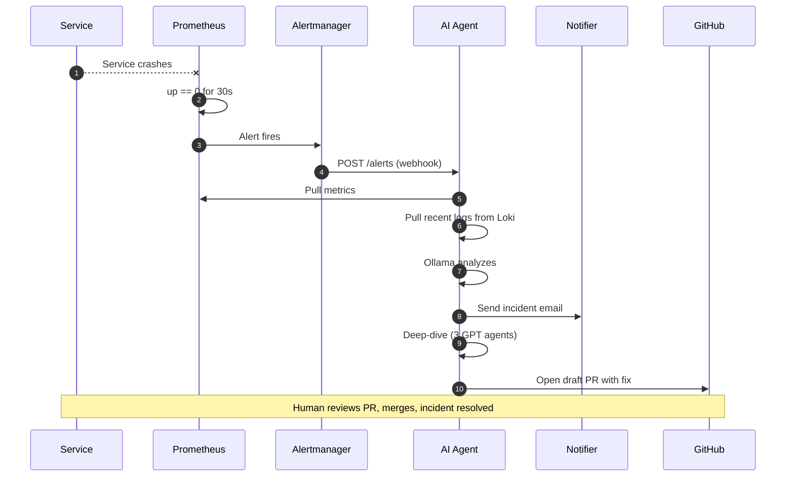
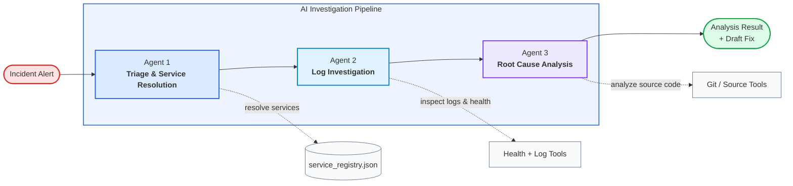

# Incident Response Agent

An AI-assisted incident response system for local microservices.

The project connects application telemetry, alerts, logs, and LLM analysis into one incident workflow. Instead of making an on-call engineer jump between Prometheus, Loki, service logs, and source code, the agent gathers the first layer of context automatically and produces a structured incident summary.

## Inspiration

Production outages are stressful because the answer is rarely in one place. Metrics live in Prometheus, logs live in another system, deployment context may be in Git, and the on-call engineer still has to connect the dots under pressure.

This project was built around one question:

> What if the first pass of incident triage could be automated before someone opens five dashboards and starts grepping logs?

The goal is not to replace engineers. The goal is to give them a useful first draft: what fired, what changed, what evidence exists, what probably caused it, and what to check next.

## What It Does

Incident Response Agent monitors demo services and reacts when Prometheus detects an incident.

When something goes wrong, such as service downtime, MongoDB dependency failure, or rising 5xx errors:

1. Prometheus evaluates alert rules.
2. Alertmanager sends a webhook to `incident-agent-workflow`.
3. The agent queries Prometheus for live metrics.
4. The agent queries Loki for recent logs from the affected service.
5. The agent sends structured context to a local Ollama model.
6. The analysis is logged for Grafana, debugging, and follow-up.
7. The notifier sends a structured incident email.
8. The deeper GPT agent pipeline investigates logs and source code.
9. The remediation flow opens a draft GitHub pull request for human review.

For deeper investigation, the repo also includes a host-run 3-agent OpenAI pipeline under `apps/agent/`:

| Agent | Role | Responsibility |
| --- | --- | --- |
| Agent 1 | Triage and service resolution | Identifies the affected service and resolves service configuration |
| Agent 2 | Investigation | Runs health checks, scans logs, and extracts stack traces |
| Agent 3 | Root cause analysis | Reads source context around relevant file/line locations and suggests fixes |

The default Docker demo starts with the local Ollama workflow. The deeper OpenAI pipeline runs separately on the host and powers source-level investigation and draft PR generation.

## System Design



### Design Flow

1. **A service fails**

   A monitored service crashes, becomes unreachable, or starts returning errors. Each service exposes `/metrics` and writes logs under `apps/<service>/logs/`.

2. **Prometheus detects the outage**

   Prometheus scrapes targets from `monitoring/targets.docker.yml`. When `up == 0` for 30 seconds, or another rule in `monitoring/alert-rules.yml` fires, the incident starts.

3. **Alertmanager calls the AI agent**

   When a rule fires, Alertmanager sends an Alertmanager-compatible payload to:

   ```text
   http://incident-agent-workflow:9100/alerts
   ```

4. **The agent gathers context**

   The workflow queries Prometheus for service health and 5xx rates, then queries Loki for recent logs using the same `service` label from the alert.

5. **Ollama generates the first incident summary**

   The current Docker workflow sends the context to Ollama running on the host at `host.docker.internal:11434` using `mistral-nemo`.

6. **The notifier sends the incident email**

   The notifier receives the structured incident result and sends an email with the alert, service, summary, and AI analysis.

7. **The GPT pipeline performs the deep dive**

   The 3-agent pipeline resolves the service, checks health, scans logs, extracts stack traces, and reads source context around the likely failure.

8. **GitHub receives a draft PR**

   When the investigation finds a concrete remediation, the system opens a draft GitHub pull request so a human can review the fix before merging.

9. **Humans stay in control**

   The PR is intentionally draft-first. Engineers review the evidence, tests, and diff before merging and resolving the incident.

## Agentic Investigation And Git Flow

This diagram shows how the deep-dive pipeline breaks the incident into agent responsibilities and how Git/source tooling fits into the draft-fix path.



1. **Agent 1 resolves the service**

   The pipeline starts from the incident alert and uses `service_registry.json` to map the service name to health URLs, log paths, repository paths, and language/runtime context.

2. **Agent 2 investigates runtime evidence**

   The second agent checks service health, reads the relevant logs, searches for errors, and extracts stack traces or request context that explain what failed.

3. **Agent 3 inspects source code**

   The final agent uses Git/source tools to inspect the files and line ranges connected to the stack trace or error context. This is where the pipeline moves from "what failed" to "why this code likely failed."

4. **The output becomes a draft fix**

   The result includes root-cause analysis, supporting evidence, and a proposed code change. That proposed fix is what feeds the GitHub draft PR flow for human review.

For detailed diagrams of both AI paths, see [architecture.md](architecture.md).

## How We Built It

The full local environment is orchestrated with Docker Compose.

### Application Layer

- `weather-app1`: FastAPI weather service on port `8000`
- `mongo-api-service`: FastAPI CRUD service backed by MongoDB on port `9000`
- Prometheus `/metrics` endpoints via `prometheus-fastapi-instrumentator`
- File-based logs mounted into Promtail

### Observability Stack

- Prometheus for metrics scraping and alert rules
- Alertmanager for alert grouping and webhook dispatch
- Promtail and Loki for log aggregation
- Grafana for exploring metrics and logs

### Alert Workflow

- `incident-agent-workflow` receives `POST /alerts`
- It queries Prometheus for `up` and 5xx-rate signals
- It queries Loki for recent service logs
- It builds a structured incident context object
- It sends that context to Ollama
- It logs the generated analysis as `ollama_analysis`
- It sends the result to the notifier for incident email delivery
- It can hand off complex incidents to the 3-agent deep-dive pipeline

### Notification System

The repo includes a FastAPI notifier service under `apps/notifier/`.

- SMTP email support is implemented.
- The workflow posts incident results to `/notify`.
- The email includes the affected service, alert name, summary, and AI analysis.
- Local demo mail tools such as Mailpit can be used by pointing the notifier SMTP settings to that local SMTP server.

### Deep Investigation Pipeline

The host-run pipeline under `apps/agent/` uses OpenAI and deterministic tools for:

- service configuration resolution
- health checks
- log scanning
- stack-trace extraction
- source-file inspection through Git commands

### Draft PR Automation

After the deep-dive agents identify a reliable fix, the remediation flow creates a minimal patch and opens a draft GitHub pull request. The PR stays in draft state so engineers can inspect the evidence, review the code, run tests, and merge only when they agree with the fix.

### Reporting

The repo includes report tooling for demo and postmortem artifacts:

- `apps/log_watcher.py`
- `apps/monitor_service.py`
- `apps/report_generator.py`

Generated reports are written under `apps/reports/`.

## Repository Layout

```text
.
|-- docker-compose.yml
|-- architecture.md
|-- README.md
|-- apps/
|   |-- weather-app1/
|   |-- mongo-api-service/
|   |-- incident-agent-workflow/
|   |-- agent/
|   |-- notifier/
|   |-- log_watcher.py
|   |-- monitor_service.py
|   `-- report_generator.py
`-- monitoring/
    |-- prometheus.yml
    |-- targets.docker.yml
    |-- alert-rules.yml
    |-- alertmanager.yml
    |-- loki-config.yml
    |-- promtail-config.yml
    `-- grafana/provisioning/
```

## Run Locally

### Prerequisites

- Docker and Docker Compose
- Ollama running on your host machine
- The `mistral-nemo` model pulled locally

```bash
ollama pull mistral-nemo
ollama serve
```

If Ollama is already running, `ollama serve` may report that the port is in use. That is fine.

### Configure Mongo API

Create `apps/mongo-api-service/.env`:

```bash
cat > apps/mongo-api-service/.env <<'EOF'
MONGO_URI=mongodb://mongo:27017
MONGO_DB=servicedb
APP_NAME=Mongo API Service
LOG_FILE=/app/logs/service.log
EOF
```

### Start The Stack

```bash
docker compose up -d --build
```

Check status:

```bash
docker compose ps
```

Stop the stack:

```bash
docker compose down
```

## Service URLs

| Service | URL |
| --- | --- |
| Weather API | http://localhost:8000 |
| Mongo API | http://localhost:9000 |
| Incident workflow | http://localhost:9100 |
| Prometheus | http://localhost:9090 |
| Alertmanager | http://localhost:9093 |
| Grafana | http://localhost:3000 |
| Loki | http://localhost:3100 |
| MongoDB | `localhost:27017` |

Grafana credentials are `admin` / `admin`.

## Verify The Demo

Check service health:

```bash
curl http://localhost:8000/
curl http://localhost:9000/health
curl http://localhost:9100/health
```

Check Prometheus targets:

```text
http://localhost:9090/targets
```

Create a Mongo item:

```bash
curl -X POST http://localhost:9000/items/ \
  -H "Content-Type: application/json" \
  -d '{"name":"demo","description":"test item","value":42}'
```

Query the weather service:

```bash
curl "http://localhost:8000/weather/latitude=41.8781&longitude=-87.6298"
```

Trigger a test alert manually:

```bash
curl -X POST http://localhost:9100/alerts \
  -H "Content-Type: application/json" \
  -d '{
    "alerts": [
      {
        "status": "firing",
        "labels": {
          "alertname": "ServiceDown",
          "service": "weather-app1"
        },
        "annotations": {
          "summary": "weather-app1 is not responding"
        }
      }
    ]
  }'
```

Watch the incident analysis:

```bash
docker compose logs -f incident-agent-workflow
```

Or inspect the log file:

```bash
tail -f apps/incident-agent-workflow/logs/workflow.log
```

Look for `ollama_analysis`.

## Active Alerts

Alert rules live in [monitoring/alert-rules.yml](monitoring/alert-rules.yml).

| Alert | Condition | Severity |
| --- | --- | --- |
| `ServiceDown` | Prometheus cannot scrape a service for 30 seconds | `critical` |
| `MongoDependencyDown` | `mongo-api-service` cannot ping MongoDB for 30 seconds | `critical` |
| `Service5xxErrors` | A service has non-zero 5xx rate for 30 seconds | `warning` |

## Useful Queries

Prometheus:

```promql
up
sum by (service) (up)
sum by (service, handler, method, status) (rate(http_requests_total[1m]))
sum by (service) (rate(http_requests_total{status="5xx"}[2m]))
dependency_up{service="mongo-api-service", dependency="mongodb"}
```

Loki:

```logql
{service="weather-app1"}
{service="mongo-api-service"}
{service="incident-agent-workflow"}
{service="incident-agent-workflow"} |= "ollama_analysis"
{service="mongo-api-service"} |= "ERROR"
```

## API Reference

### `weather-app1`

| Method | Path | Description |
| --- | --- | --- |
| `GET` | `/` | Basic service check |
| `GET` | `/weather/latitude={latitude}&longitude={longitude}` | Fetch weather data from Open-Meteo |
| `GET` | `/metrics` | Prometheus metrics |

### `mongo-api-service`

| Method | Path | Description |
| --- | --- | --- |
| `GET` | `/health` | Liveness check |
| `GET` | `/health/ready` | MongoDB readiness check |
| `POST` | `/items/` | Create item |
| `GET` | `/items/` | List items |
| `GET` | `/items/{item_id}` | Get item |
| `PUT` | `/items/{item_id}` | Update item |
| `DELETE` | `/items/{item_id}` | Delete item |
| `GET` | `/metrics` | Prometheus metrics |

### `incident-agent-workflow`

| Method | Path | Description |
| --- | --- | --- |
| `GET` | `/health` | Liveness check |
| `POST` | `/alerts` | Alertmanager webhook receiver |
| `GET` | `/metrics` | Prometheus metrics |

## Deep-Dive OpenAI Pipeline

Run this separately from the Docker demo when you want deeper log, source, and draft-PR analysis.

```bash
cd apps/agent
python3 -m venv .venv
source .venv/bin/activate
pip install -r ../../requirements.txt openai
export OPENAI_API_KEY=your_key_here
uvicorn main:app --host 0.0.0.0 --port 8001 --reload
```

Endpoints:

```text
GET  http://localhost:8001/health
GET  http://localhost:8001/services
POST http://localhost:8001/analyze
```

`apps/log_watcher.py` can call this pipeline and generate Word reports. It currently contains local machine paths, so update `LOG_SOURCES` before using it. If the pipeline runs on port `8001`, pass `--agent-url http://localhost:8001`.

## Challenges We Ran Into

### Docker To Host LLM Communication

Ollama runs on the host machine, while the workflow runs in Docker. The workflow uses `host.docker.internal:11434` so containers can reach the host LLM server.

### Observability Integration

The system depends on consistent labels across Prometheus, Alertmanager, Loki, and Promtail. If a `service` label or log path is wrong, the agent can receive the alert but miss the log context.

### Useful Notifications

Raw model output can be too noisy during incidents. The notifier exists so incident summaries can be sent in a concise email format when SMTP is configured.

### Two AI Paths

The local Ollama workflow is fast and works well for first-pass triage. The OpenAI pipeline is deeper and better suited for log, stack-trace, source-code analysis, and draft PR generation. Separating those paths keeps the demo understandable.

### Safe Draft PR Automation

Automatically proposing fixes creates risk if the system writes too much or merges without review. The project uses draft GitHub pull requests as the handoff point so humans approve the remediation.

## Accomplishments

- Built a complete local incident-response loop from alert to AI-generated analysis.
- Connected metrics, logs, alerts, and LLM context instead of building a standalone chatbot.
- Added Prometheus, Alertmanager, Loki, Promtail, and Grafana as a production-style observability stack.
- Implemented a multi-agent investigation pipeline for deeper analysis.
- Added notifier-based incident emails.
- Added GitHub draft PR handoff for proposed remediations.
- Added report generation tools for demos and postmortems.
- Documented the system with Mermaid diagrams and runnable setup steps.

## What We Learned

- Alerts are only the trigger; context is the real product.
- AI analysis is only useful when it is grounded in telemetry.
- Labels and log paths matter as much as the model.
- Structured summaries are more useful than long explanations during incidents.
- Automation should produce reviewable suggestions before it makes changes.
- A fast local triage path and a deeper investigation path serve different needs.

## What's Next

### Smarter Remediation

- confidence scoring
- automated test suggestions
- safer "do not propose a fix" thresholds
- stronger guardrails around when a draft PR should be opened

### More Notification Channels

- Slack
- PagerDuty
- mobile-friendly escalation paths

### Unified Incident Routing

- simple alerts use local Ollama triage
- complex alerts use the deeper AI pipeline
- high-confidence findings create reviewable remediation proposals

### Runbook And Ticketing Integration

- runbook lookup
- Jira or Linear issue creation
- automatic incident linking


## Troubleshooting

### `incident-agent-workflow` logs `LLM error`

Check that Ollama is running and the model is available:

```bash
ollama list
ollama pull mistral-nemo
```

### Prometheus target is `DOWN`

Check containers and service logs:

```bash
docker compose ps
docker compose logs weather-app1
docker compose logs mongo-api-service
docker compose logs incident-agent-workflow
```

### Mongo API fails to start

Confirm `apps/mongo-api-service/.env` exists and MongoDB is healthy:

```bash
docker compose ps mongo
docker compose logs mongo
```

### Grafana has no logs

Check Promtail and Loki:

```bash
docker compose logs promtail
docker compose logs loki
```

Also confirm log files exist under `apps/*/logs/`.
