# Architecture

This document describes how the **Incident Response Agent** system is structured, how data flows between components, and how the two AI analysis paths relate to each other.

For setup and run instructions, see [README.md](README.md).

---

## Overview

The project demonstrates **automated incident triage** for microservices. It combines:

- **Sample services** that emit metrics and logs
- **Observability** (Prometheus, Loki, Grafana, Alertmanager)
- **AI-driven analysis** when alerts fire or errors are submitted manually

There are two complementary analysis modes:

| Mode | Trigger | LLM | Runtime |
|------|---------|-----|---------|
| **Alert-driven workflow** | Prometheus → Alertmanager webhook | Ollama (`mistral-nemo` on host) | Docker (`incident-agent-workflow`) |
| **3-agent pipeline** | HTTP `POST /analyze` or log watcher | OpenAI GPT-4o | Host (`apps/agent/`) |

The Docker stack is the primary end-to-end demo. The 3-agent pipeline is a deeper, host-run path for log grep, stack-trace parsing, and source-level root-cause analysis.

---

## Flow diagrams

Quick reference — click through the sections below for the full narrative.

| Diagram | What it shows |
|---------|----------------|
| [Two analysis paths](#two-analysis-paths) | When Docker/Ollama vs host/GPT pipeline runs |
| [Incident lifecycle](#incident-lifecycle) | Healthy → alert → analysis → resolution |
| [Metrics pipeline](#metrics-pipeline) | How Prometheus detects problems |
| [Logs pipeline](#logs-pipeline) | How logs reach Loki and Grafana |
| [Webhook handler](#webhook-handler-flow) | Steps inside `POST /alerts` |
| [3-agent pipeline](#3-agent-pipeline-flow) | Triage → investigation → code analysis |
| [Agent 2 branches](#agent-2-investigation-branches) | `service_error` vs `api_error` paths |
| [Log watcher](#log-watcher-flow) | Offline log scan → report |
| [Deployment view](#deployment-view) | Host vs Docker boundaries |

### Two analysis paths

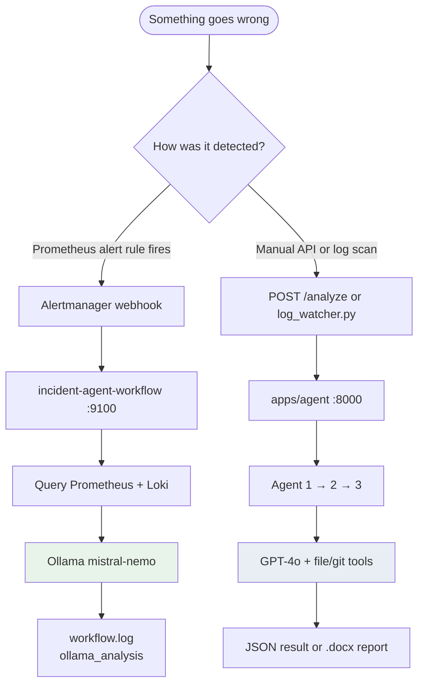

### Incident lifecycle

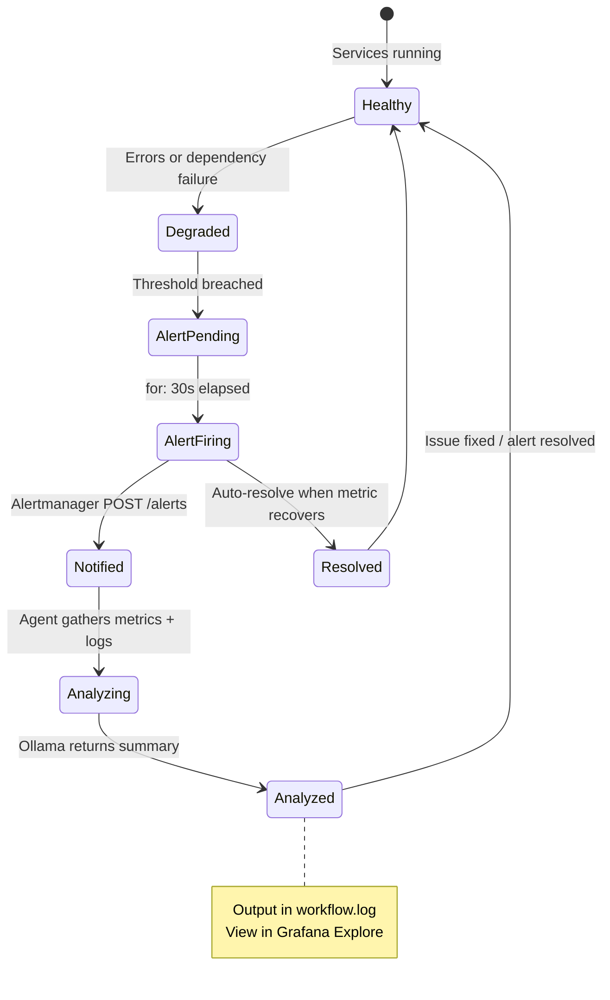

### Metrics pipeline

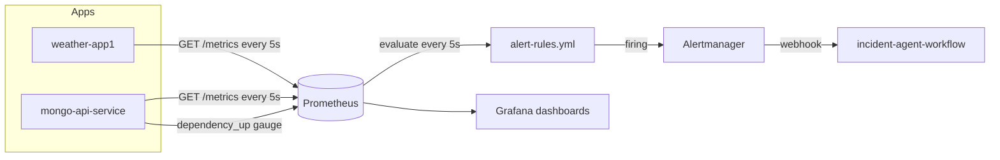

### Logs pipeline

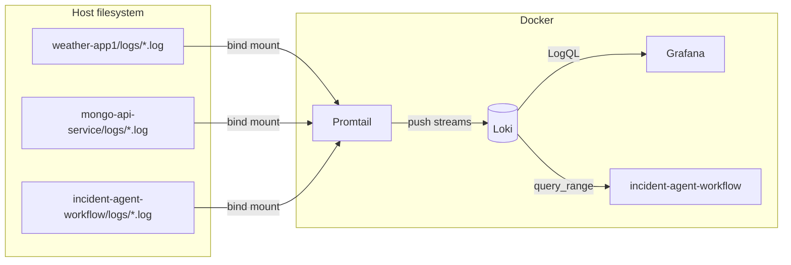

### Webhook handler flow

Detailed steps inside `apps/incident-agent-workflow/main.py` when Alertmanager calls `POST /alerts`:

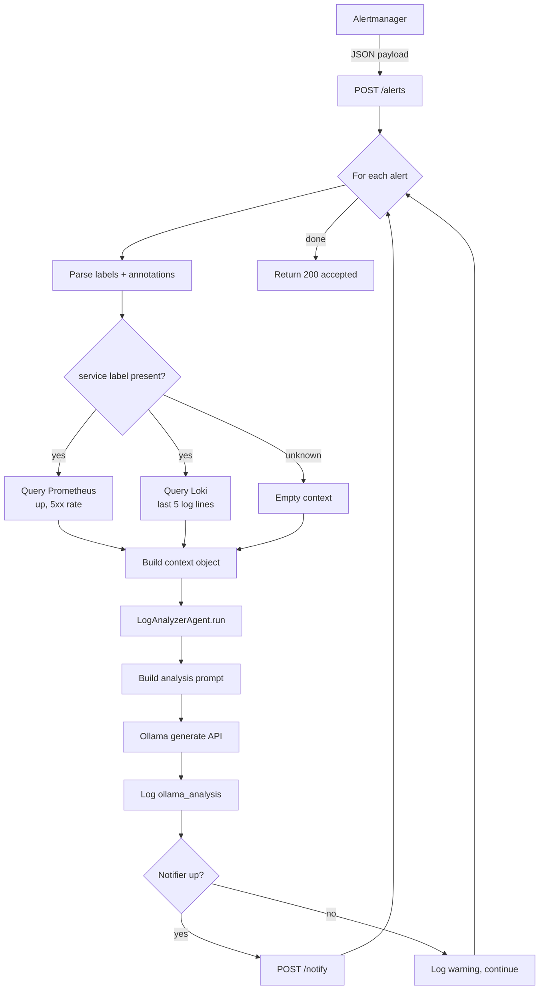

### 3-agent pipeline flow

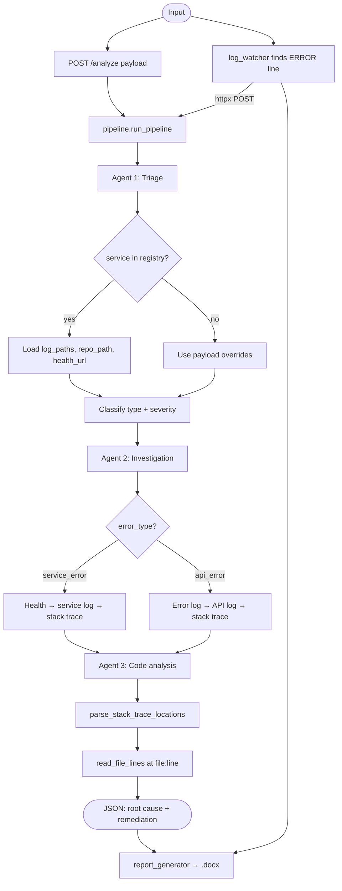

### Agent 2 investigation branches

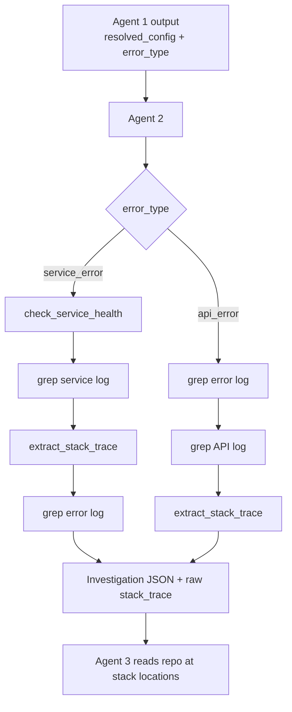

### Log watcher flow

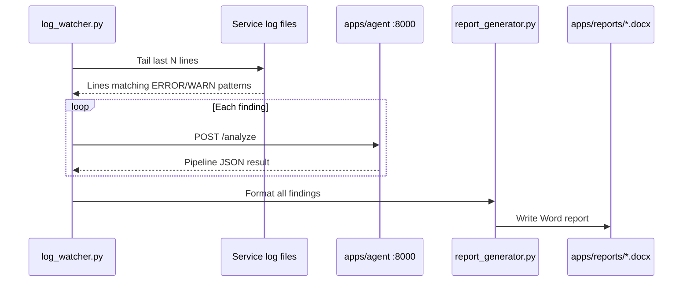

### Deployment view

What runs **inside Docker** vs on the **host machine**:

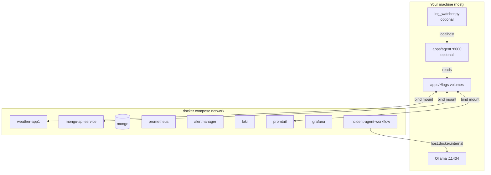

---

## High-level architecture

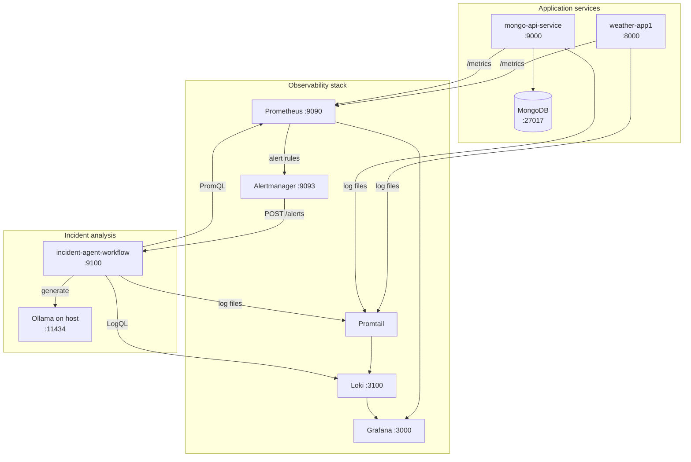

---

## Repository layout

```text
incident-response-agent/
├── docker-compose.yml              # Full stack orchestration
├── architecture.md                 # This file
├── README.md                       # Setup and operations
│
├── apps/
│   ├── weather-app1/               # Demo FastAPI weather API
│   ├── mongo-api-service/          # Demo FastAPI + MongoDB CRUD API
│   ├── incident-agent-workflow/    # Alert webhook + Ollama analysis
│   ├── agent/                      # 3-agent GPT pipeline (host-only)
│   ├── notifier/                   # Optional email notifier (disabled in compose)
│   ├── log_watcher.py              # Scans logs → calls agent pipeline → .docx report
│   └── report_generator.py         # Word report formatting for log watcher
│
└── monitoring/
    ├── prometheus.yml              # Scrape + alertmanager routing
    ├── alert-rules.yml             # ServiceDown, MongoDependencyDown, 5xx
    ├── alertmanager.yml            # Webhook to incident-agent-workflow
    ├── targets.docker.yml          # Prometheus scrape targets
    ├── loki-config.yml
    ├── promtail-config.yml         # Ships app logs to Loki
    └── grafana/provisioning/       # Datasource auto-provision
```

---

## Docker stack components

All services below are defined in `docker-compose.yml` unless noted.

### Application tier

#### weather-app1 (`:8000`)

- FastAPI service that proxies weather data from [Open-Meteo](https://open-meteo.com/).
- Exposes Prometheus metrics via `prometheus-fastapi-instrumentator` at `/metrics`.
- Writes structured logs to `apps/weather-app1/logs/app.log`.

#### mongo-api-service (`:9000`)

- FastAPI CRUD API backed by MongoDB.
- Background task pings Mongo every 5s and exposes `dependency_up` / `dependency_last_check_timestamp_seconds` metrics for the `MongoDependencyDown` alert.
- Requires `apps/mongo-api-service/.env` (not committed).

#### MongoDB (`:27017`)

- Persistent volume `mongo_data`.
- Health-gated startup for `mongo-api-service`.

### Observability tier

#### Prometheus (`:9090`)

- Scrapes targets from `monitoring/targets.docker.yml` every **5s**.
- Evaluates rules in `monitoring/alert-rules.yml`.
- Forwards firing alerts to Alertmanager.

**Scrape targets (Docker network):**

| Target | Label `service` |
|--------|-----------------|
| `weather-app1:8000` | `weather-app1` |
| `mongo-api-service:9000` | `mongo-api-service` |
| `incident-agent-workflow:9100` | `incident-agent-workflow` |

#### Alertmanager (`:9093`)

- Groups alerts by `alertname` and `service`.
- Sends webhooks to `http://incident-agent-workflow:9100/alerts`.
- Includes resolved notifications (`send_resolved: true`).

#### Loki (`:3100`) + Promtail

- Promtail tails mounted log directories and pushes to Loki with a `service` label.
- Log paths are bind-mounted from host `apps/*/logs` into Promtail read-only mounts.

**Log sources shipped to Loki:**

| Label `service` | Host path |
|-----------------|-----------|
| `weather-app1` | `apps/weather-app1/logs/*.log` |
| `mongo-api-service` | `apps/mongo-api-service/logs/*.log` |
| `incident-agent-workflow` | `apps/incident-agent-workflow/logs/*.log` |

#### Grafana (`:3000`)

- Pre-provisioned Prometheus and Loki datasources.
- Default credentials: `admin` / `admin`.

### AI workflow tier

#### incident-agent-workflow (`:9100`)

Entry point for the **alert-driven** path.

**`POST /alerts`** (Alertmanager webhook payload):

1. Parse each alert’s `labels`, `annotations`, and `status`.
2. Query **Prometheus** for service-specific metrics (`up`, 5xx rate).
3. Query **Loki** for the last 5 log lines matching `{service="<name>"}`.
4. Build a structured context object and run `LogAnalyzerAgent`.
5. Log analysis as `ollama_analysis` in `apps/incident-agent-workflow/logs/workflow.log`.
6. Attempt to POST results to the notifier (service is commented out in compose).

**Ollama integration:**

- URL: `http://host.docker.internal:11434` (host machine from inside container).
- Model: `mistral-nemo`.
- Requires Ollama running on the host with the model pulled.

---

## Alert-driven data flow

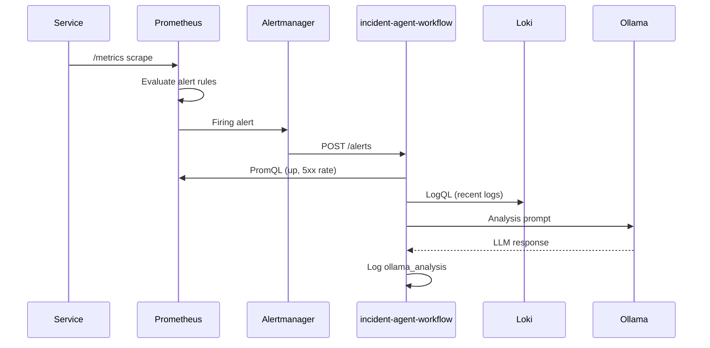

### Active alert rules

| Alert | Expression (summary) | Severity | `for` |
|-------|----------------------|----------|-------|
| `ServiceDown` | `up{job="local-services"} == 0` | critical | 30s |
| `MongoDependencyDown` | `dependency_up{...} == 0` | critical | 30s |
| `Service5xxErrors` | non-zero 5xx rate | warning | 30s |

Labels include `service` (from Prometheus target labels) so the workflow can scope metrics and log queries.

### Which alert fired?

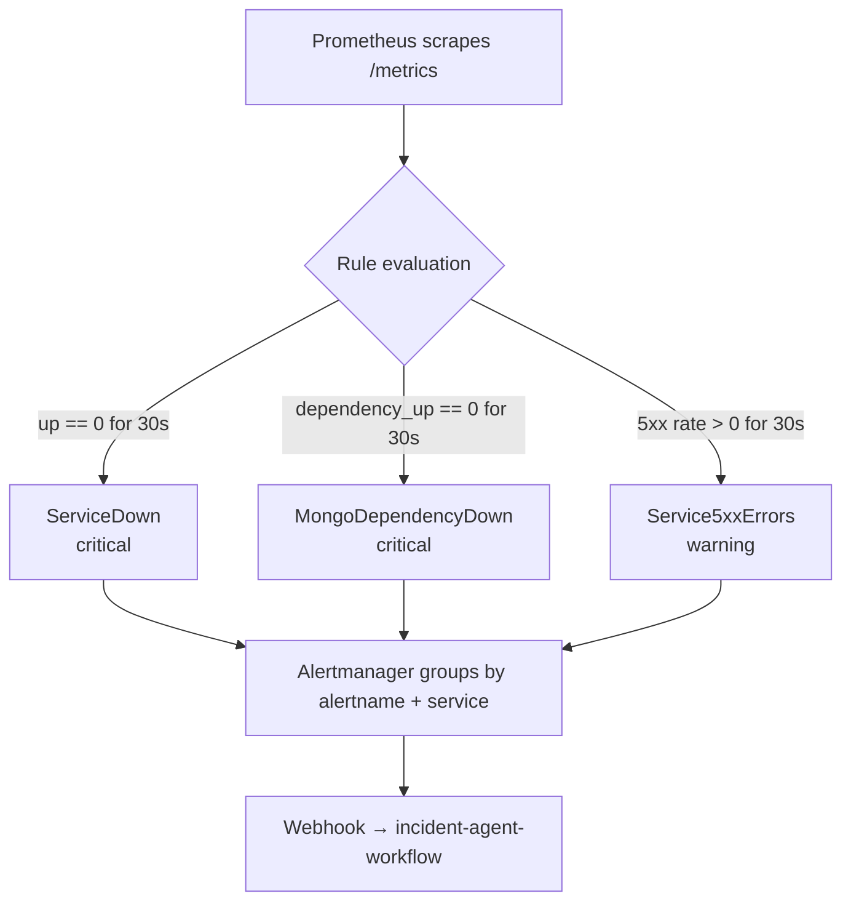

---

## 3-agent pipeline architecture

Located under `apps/agent/`. Runs **outside** the main Docker Compose stack and uses **OpenAI GPT-4o** via the Agents SDK pattern in `agents/base.py`.

### Entry points

| Entry | Description |
|-------|-------------|
| `POST /analyze` | FastAPI endpoint; accepts `ErrorPayload` (service name, error message, optional overrides) |
| `log_watcher.py` | Scans local log files for error patterns, calls the pipeline per hit, generates `.docx` via `report_generator.py` |

Default API port in `main.py`: **8000** (configure `log_watcher.py` `--agent-url` accordingly).

### Pipeline stages

See [3-agent pipeline flow](#3-agent-pipeline-flow) and [Agent 2 investigation branches](#agent-2-investigation-branches) for detailed diagrams.

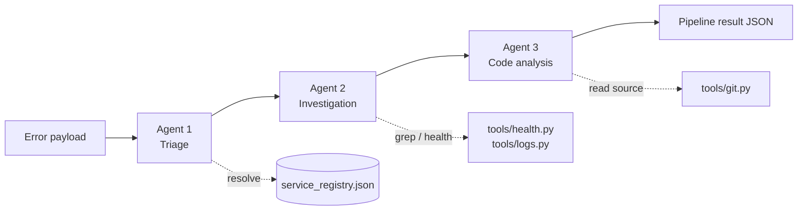

#### Agent 1 — Error Triage

- Resolves `log_paths`, `repo_path`, and `health_url` from `service_registry.json` (or request overrides).
- Classifies error as `service_error` or `api_error`.
- Assigns severity and predefined actions (log, alert, incident).
- Output: `resolved_config` passed to downstream agents.

#### Agent 2 — Investigation

Branches on `error_type` from Agent 1:

- **service_error**: health check → grep service log → extract stack trace → grep error log.
- **api_error**: grep error log → grep API log → extract stack trace.

Uses **deterministic tools** (not LLM-only) for log grep and stack-trace extraction; LLM synthesizes findings.

#### Agent 3 — Code Analysis

- Parses `file:line` locations from Agent 2’s stack trace.
- Reads only implicated files/ranges from `repo_path` via git/code tools.
- Returns root cause, complexity assessment, and remediation hints.
- Falls back to broader investigation strategies if scope exceeds thresholds.

### Service registry

`apps/agent/service_registry.json` maps logical service names to:

- `health_url`
- `log_paths` (`service`, `error`, `api`)
- `repo_path`
- `language`

Add entries here (or pass overrides in the request) when onboarding new services to the host pipeline.

### Agent tools

| Module | Responsibility |
|--------|----------------|
| `tools/health.py` | HTTP health checks |
| `tools/logs.py` | Read, grep, stack-trace extraction from log files |
| `tools/git.py` | List files, read line ranges, grep codebase, parse stack locations |

---

## Port reference

| Service | Port | Protocol |
|---------|------|----------|
| weather-app1 | 8000 | HTTP |
| mongo-api-service | 9000 | HTTP |
| MongoDB | 27017 | TCP |
| incident-agent-workflow | 9100 | HTTP |
| Prometheus | 9090 | HTTP |
| Alertmanager | 9093 | HTTP |
| Grafana | 3000 | HTTP |
| Loki | 3100 | HTTP |
| Ollama (host) | 11434 | HTTP |
| 3-agent pipeline (host) | 8000 | HTTP |
| notifier (optional) | 8002 | HTTP |

---

## Configuration and secrets

| Component | Config | Notes |
|-----------|--------|-------|
| mongo-api-service | `apps/mongo-api-service/.env` | `MONGO_URI`, `MONGO_DB`, `LOG_FILE` — create before first run |
| incident-agent-workflow | `llm/ollama_client.py` | `OLLAMA_URL`, `OLLAMA_MODEL` |
| 3-agent pipeline | `apps/agent/.env` | `OPENAI_API_KEY`, `OPENAI_MODEL` — never commit |
| notifier | `apps/notifier/.env` | Email settings; service disabled in default compose |

---

## Extending the system

### Add a new monitored service

1. Create the service under `apps/<name>/` with `/metrics` and file-based logging.
2. Add a `Dockerfile` and service block to `docker-compose.yml`.
3. Register scrape target in `monitoring/targets.docker.yml` with a `service` label.
4. Add log path in `monitoring/promtail-config.yml`.
5. Optionally add alert rules in `monitoring/alert-rules.yml`.
6. For the 3-agent pipeline, add an entry to `apps/agent/service_registry.json`.

### Add a new alert → workflow behavior

1. Define rule in `monitoring/alert-rules.yml` (include `service` label when possible).
2. Ensure Alertmanager routes to `incident-agent-workflow` (default receiver in `alertmanager.yml`).
3. Extend `query_prometheus()` or `query_loki()` in `apps/incident-agent-workflow/main.py` if new context is needed.

---

## Design decisions

| Decision | Rationale |
|----------|-----------|
| Ollama on host, not in Docker | Keeps LLM weights off container images; uses `host.docker.internal` for Mac/Windows Docker |
| Promtail file tailing vs app-side push | Simple bind-mount of existing log files; no app code changes for Loki |
| Two AI paths | Fast alert narrative (Ollama) vs deep code investigation (GPT + tools) |
| Prometheus file SD | `targets.docker.yml` is easy to edit without reloading static configs in code |
| Notifier commented out in compose | Core demo works without SMTP credentials |

---

## Related files

| Topic | File |
|-------|------|
| Compose orchestration | `docker-compose.yml` |
| Alert webhook handler | `apps/incident-agent-workflow/main.py` |
| Ollama prompt agent | `apps/incident-agent-workflow/agents/log_analyzer_agent.py` |
| Pipeline orchestration | `apps/agent/pipeline.py` |
| Alert rules | `monitoring/alert-rules.yml` |
| Webhook routing | `monitoring/alertmanager.yml` |
